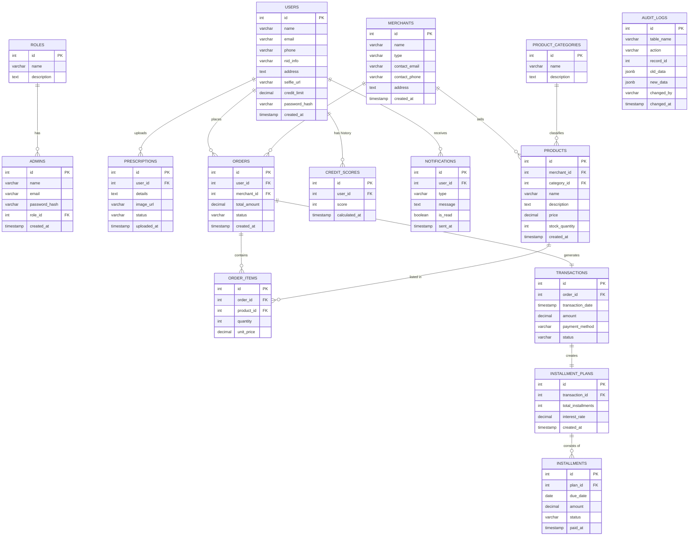

# Proyojon - ER Diagram

This document contains the Entity-Relationship (ER) diagram for the **Proyojon** system, representing the current database schema.

## 1. ER Diagram (Mermaid)

## 2. Key Entity Relationships

- **Users & Orders**: A one-to-many relationship where one user can place multiple orders.
- **Merchants & Products**: A one-to-many relationship where one merchant can list multiple products for sale.
- **Orders & Transactions**: Each order generates one transaction.
- **Transactions & Installment Plans**: A transaction can lead to one installment plan (if chosen as the payment method).
- **Installment Plans & Installments**: One plan is broken down into multiple monthly installments.
- **Auditing**: The `AUDIT_LOGS` table tracks changes across all major tables but does not have direct foreign key constraints to allow for record deletion persistence.
