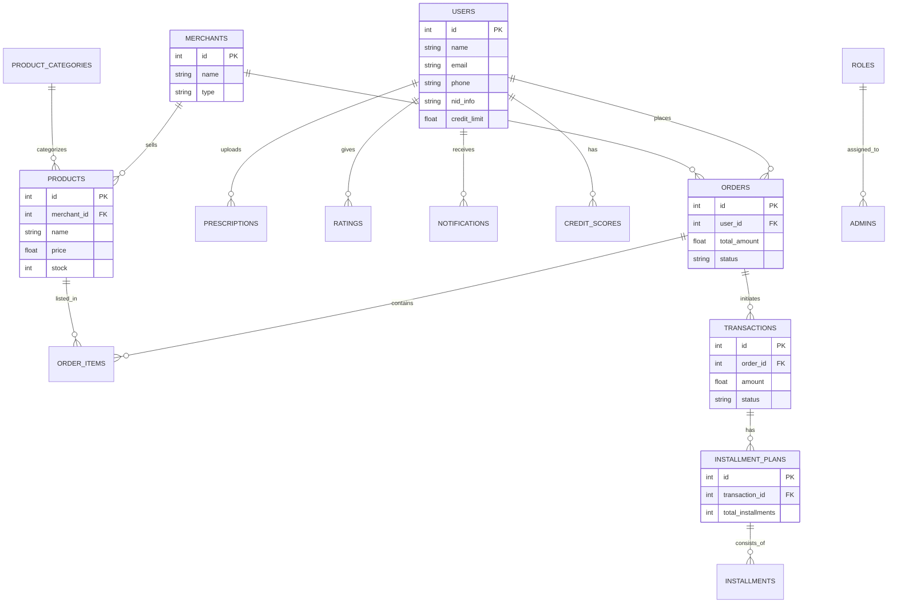

# Entity Relationship Diagram (ERD)

## Schema Description
The schema is normalized to 3NF.
- **Users**: Central entity.
- **Merchants**: Aggregates Pharmacies and other vendors.
- **Orders & Transactions**: Separated to allow complex payment flows (like installments).
- **Audit Logs**: (Not shown in ERD relationally) Tracks all changes.
